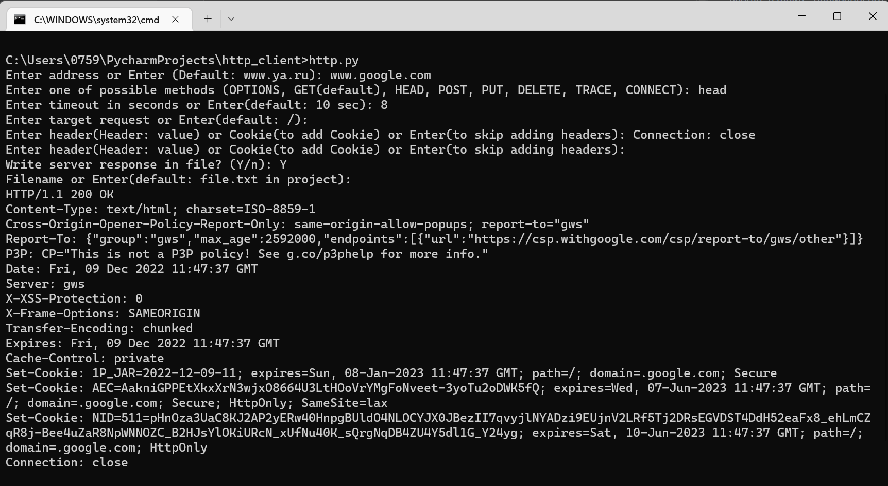

## HTTP - клиент

### Использование

Ввод параметров HTTP-запроса из консоли, получение ответа от сервера
(вывод на консоль всегда, в файл - опционально)

### Возможности

- отправление HTTP-запроса на сервер, получение ответа сервера
- запись в файл ответа сервера
- поддержка Cookie
- таймаут ожидания ответа сервера
- обработка редиректов (автопереход)
- поддержка ретраев
- при нажатии Enter выбираются параметры по умолчанию
  (Enter == default)

### Состав проекта

1. http.py - файл с основной функциональностью (формирование и отправка
   запроса, обработка ответа сервера)

2. retry.py - библиотека ретраев

3. test_.py - модульные тесты

4. file.txt - файл для записи ответа сервера по умолчанию

5. requirements.txt - невстроенные библиотеки, необходимые для работы проекта

6. readme.md - файл с описанием проекта в формате Markdown

7. img.png - пример работы с http-клиентом

### Запуск

```python3 http.py```

### Пример запуска


